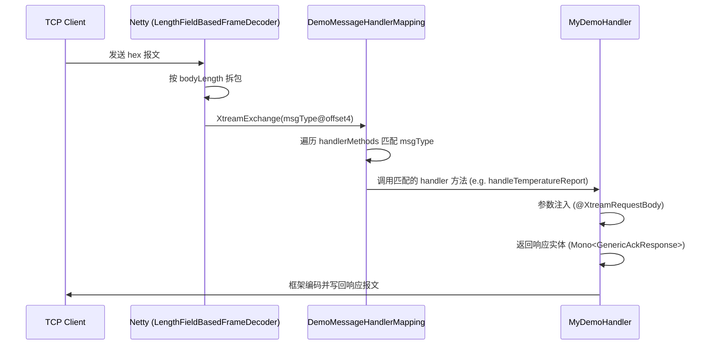

# X-IoT Demo — 自定义注解驱动的私有协议服务端

演示如何通过 **自定义注解** + `AbstractSimpleXtreamRequestMappingHandlerMapping` 为私有 TCP 协议构建非阻塞服务端，**无需 Spring Boot**。

> 本示例由 Big Pickle (AI, [opencode](https://opencode.ai/)) 与 [hylexus](https://github.com/hylexus) 共同完成。

## 协议定义

### 报文头格式（7 字节，所有消息共用）

| 偏移 | 长度 | 类型       | 说明                    |
|----|----|----------|-----------------------|
| 0  | 4  | u32 (BE) | magic，固定 `0x12345678` |
| 4  | 1  | u8       | msgType，消息类型          |
| 5  | 2  | u16 (BE) | bodyLength，消息体长度      |
| 7  | N  | —        | 消息体，长度由 bodyLength 决定 |

### 消息类型

| 方向 | msgType | Handler                              | 请求实体                    | 响应实体                        |
|----|---------|--------------------------------------|-------------------------|-----------------------------|
| 请求 | `0x10`  | 心跳 — `handleHeartbeat()`             | 无消息体                    | `GenericAckResponse(0x80)`  |
| 请求 | `0x11`  | 时间查询 — `handleTimeQuery()`           | 无消息体                    | `ServerTimeResponse(0x81)`  |
| 请求 | `0x12`  | 温湿度上报 — `handleTemperatureReport()`  | `TemperatureReport`     | `GenericAckResponse`        |
| 请求 | `0x13`  | 多传感器上报 — `handleMultiSensorReport()` | `MultiSensorData`       | `GenericAckResponse`        |
| 请求 | `0x14`  | 设备注册 — `handleDeviceRegister()`      | `DeviceRegisterRequest` | `RegisterAckResponse(0x82)` |
| 请求 | `0x15`  | 报警上报 — `handleAlarmReport()`         | `AlarmReport`           | `GenericAckResponse`        |

请求 msgType 分配在 `0x10~0x15`，响应 msgType 分配在 `0x80~0x82`，互不重叠。

## 项目结构

```
custom-annotation-server/
├── custom-annotation-server.gradle.kts          # 依赖：xtream-codec-server-reactive + logging
└── src/main/java/.../custom/annotation/
    ├── XtreamCustomAnnotationServerApp.java      # 入口，手动构建 Netty 服务端
    ├── annotation/
    │   ├── DemoMessageHandler.java               # [类注解] 标记处理器类
    │   └── DemoMessageMapping.java               # [方法注解] 标记方法及 msgType
    ├── handler/
    │   ├── DemoMessageHandlerMapping.java         # 路由：按 msgType 分发到 @DemoMessageMapping 方法
    │   └── MyDemoHandler.java                     # 6 个消息处理器的实现
    └── entity/
        ├── AbstractEntity.java                   # 基类：magic + msgType + bodyLength
        ├── request/                              # 请求实体（继承 AbstractEntity）
        │   ├── TemperatureReport.java
        │   ├── MultiSensorData.java
        │   ├── DeviceRegisterRequest.java
        │   └── AlarmReport.java
        └── response/                             # 响应实体（继承 AbstractEntity，构造器设 msgType）
            ├── GenericAckResponse.java
            ├── ServerTimeResponse.java
            └── RegisterAckResponse.java
```

## 核心设计

### 1. 自定义注解体系

```java
@DemoMessageHandler    // → 标记类，@XtreamRequestHandler 的别名
@DemoMessageMapping(   // → 标记方法，@XtreamRequestHandlerMapping 的别名
        msgType = {0x12},
        scheduler = "business"  // → @AliasFor 代理到 @XtreamRequestHandlerMapping.scheduler()
)
```

`@DemoMessageMapping` 通过 `@AliasFor(annotation = XtreamRequestHandlerMapping.class, attribute = "scheduler")` 继承框架的调度器机制，无需重复实现。

### 2. 路由 — DemoMessageHandlerMapping

继承 `AbstractSimpleXtreamRequestMappingHandlerMapping`，自动获取框架内置能力：

- **包扫描**：自动发现 `@DemoMessageHandler` 标记的类
- **方法注册**：自动收集 `@DemoMessageMapping` 标记的方法
- **自定义路由**：重写 `getHandler(XtreamExchange)` 从报文偏移 4 读取 `msgType` 做分发

```java
// 关键代码：从报文头读取 msgType 并匹配
public class DemoMessageHandlerMapping extends AbstractSimpleXtreamRequestMappingHandlerMapping {
    @Override
    public Mono<Object> getHandler(XtreamExchange exchange) {
        // msgType 在报文头的第 5 字节（偏移 4），无符号
        final int msgType = exchange.request().payload().getByte(4) & 0xFF;
        log.info("Dispatching request with msgType={}(0x{})", msgType, FormatUtils.toHexString(msgType, 2));

        // FIXME 这里可以缓存到 Map 里，不用每次都遍历（为演示方便，这里直接遍历）
        for (final var handlerMethod : handlerMethods) {
            final DemoMessageMapping mapping = handlerMethod.getMethod().getAnnotation(DemoMessageMapping.class);
            if (mapping != null) {
                for (final int type : mapping.msgType()) {
                    if (type == msgType) {
                        return Mono.just(handlerMethod);
                    }
                }
            }
        }

        log.warn("No handler found for msgType={}(0x{})", msgType, FormatUtils.toHexString(msgType, 2));
        return Mono.empty();
    }
}
```

### 3. 实体 — 注解驱动编解码

```java
public abstract class AbstractEntity {
    @Preset.RustStyle.u32(order = -300)
    protected long magic = 0x12345678L;
    @Preset.RustStyle.u8(order = -200)
    protected int msgType;
    @Preset.RustStyle.u16(order = -100)
    protected int bodyLength;
}
```

所有请求继承 `AbstractEntity` 自动获得 7 字节协议头。`@Preset.RustStyle.*` 注解驱动 `EntityCodec.DEFAULT` 完成序列化/反序列化，无需手动编解码逻辑。

### 4. 响应实体约定

| 响应类                   | msgType | 构造器方式                       |
|-----------------------|---------|-----------------------------|
| `GenericAckResponse`  | `0x80`  | 无参构造设 `this.msgType = 0x80` |
| `ServerTimeResponse`  | `0x81`  | 无参构造设 `this.msgType = 0x81` |
| `RegisterAckResponse` | `0x82`  | 无参构造设 `this.msgType = 0x82` |

`msgType` 在各实体无参构造器中硬编码，确保框架编码时自动写入报文头。

## 消息处理流程



## 快速开始

### 构建

```shell
# 在项目根目录执行
./gradlew :quick-start:custom-annotation-server:compileJava
```

### 启动

直接运行 `XtreamCustomAnnotationServerApp.main()`，服务监听 `0.0.0.0:9527`。

### 测试（nc 命令）

#### 心跳 (msgType=0x10)

```shell
echo -ne '\x12\x34\x56\x78\x10\x00\x00' | nc localhost 9527
```

#### 服务器时间查询 (msgType=0x11)

```shell
echo -ne '\x12\x34\x56\x78\x11\x00\x00' | nc localhost 9527
```

响应：`12 34 56 78 81 00 06` + BCD 时间（6 字节 `yyMMddHHmmss`）。

#### 温湿度上报 (msgType=0x12)

```shell
# temperature=23.5°C(0x00EB), humidity=60.0%RH(0x78)
echo -ne '\x12\x34\x56\x78\x12\x00\x03\x00\xeb\x78' | nc localhost 9527
```

#### 多传感器数据上报 (msgType=0x13)

```shell
# temperature=22.5°C, humidity=55.0%RH, pressure=1013.2hPa
# windSpeed=3.5m/s, timestamp=1700000000000ms
echo -ne '\x12\x34\x56\x78\x13\x00\x0f\x00\xe1\x6e\x27\x94\x00\x23\x00\x00\x01\x8b\x3f\x3b\x5a\x00' | nc localhost 9527
```

#### 设备注册 (msgType=0x14)

```shell
# imei="868105040876543", productKey="AB"
echo -ne '\x12\x34\x56\x78\x14\x00\x13\x0f\x38\x36\x38\x31\x30\x35\x30\x34\x30\x38\x37\x36\x35\x34\x33\x02\x41\x42' | nc localhost 9527
```

#### 报警上报 (msgType=0x15)

```shell
# alarmType=1(通用报警), desc="overheat"
echo -ne '\x12\x34\x56\x78\x15\x00\x0b\x00\x01\x08\x6f\x76\x65\x72\x68\x65\x61\x74' | nc localhost 9527
```

## 注意事项

1. **`bodyLength` 计算**：发送请求时必须将消息体实际字节数写入报文头偏移 5-6（大端），否则 `LengthFieldBasedFrameDecoder` 解码错误导致断连。

2. **`LengthFieldBasedFrameDecoder` 参数**：`lengthFieldOffset=5`（跳过 magic 4 + msgType 1），`lengthFieldLength=2`（bodyLength 大端）。修改时必须与 `AbstractEntity` 的字段顺序和长度一致。

3. **包扫描路径**：`DemoMessageHandlerMapping` 构造参数（`"io.github.hylexus.xtream.quickstart.custom.annotation"`）必须包含 handler 所在的包，否则处理器不被发现。

4. **调度器**：`business` 调度器（`Schedulers.newBoundedElastic(4, 100, "business")`）用于设备注册等可能涉及 IO 或耗时操作的 handler。其他 handler 默认使用并行调度器。

5. **实体解码**：请求实体继承 `AbstractEntity` 后，`EntityCodec.decode()` 从报文偏移 0 开始按 `@Preset.RustStyle.*` 注解顺序解码。子类仅定义 body 字段，header 字段由父类处理。

6. **Netty ResourceLeakDetector**：默认注释掉。若启用 `PARANOID` 级别，仅用于调试内存泄漏，生产环境会带来显著性能开销。

## 扩展指南

### 添加新消息类型

1. 在 `entity/request/` 下创建请求实体，继承 `AbstractEntity`，用 `@Preset.RustStyle.*` 注解标记 body 字段
2. 在 `entity/response/` 下创建响应实体（如无需新响应类型可复用 `GenericAckResponse`）
3. 在 `MyDemoHandler` 中添加方法，标注 `@DemoMessageMapping(msgType = {0x??})`
4. 更新 `DemoMessageHandlerMapping.getHandler()` 无需改动 — 自动扫描发现新方法
5. 更新 `AbstractEntity`（如需新增公共 header 字段）

### 使用 `scheduler` 属性

```java

@DemoMessageMapping(msgType = {0x14}, scheduler = "business")
public Mono<RegisterAckResponse> handleDeviceRegister(...) { ...}
```

需先在启动类注册同名 scheduler：

```
schedulerRegistry.registerScheduler("business", Schedulers.newBoundedElastic(4, 100, "business"));
```

## 依赖

```kotlin
// custom-annotation-server.gradle.kts
dependencies {
    api(project(":xtream-codec-server-reactive"))  // 异步 TCP/UDP 服务端 + 注解驱动编解码
    api("org.springframework.boot:spring-boot-starter-logging")
}
```


